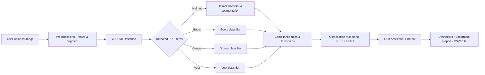
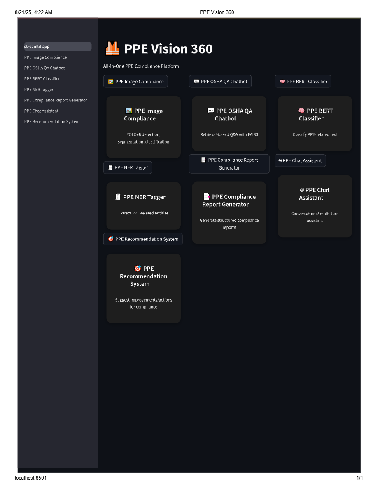
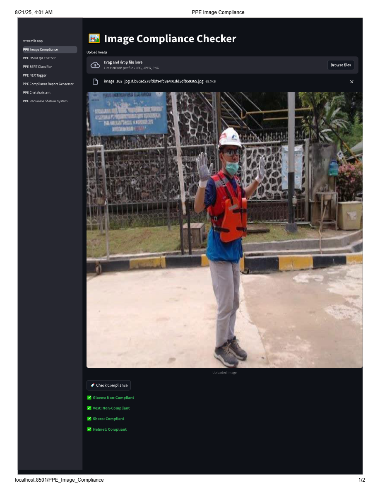
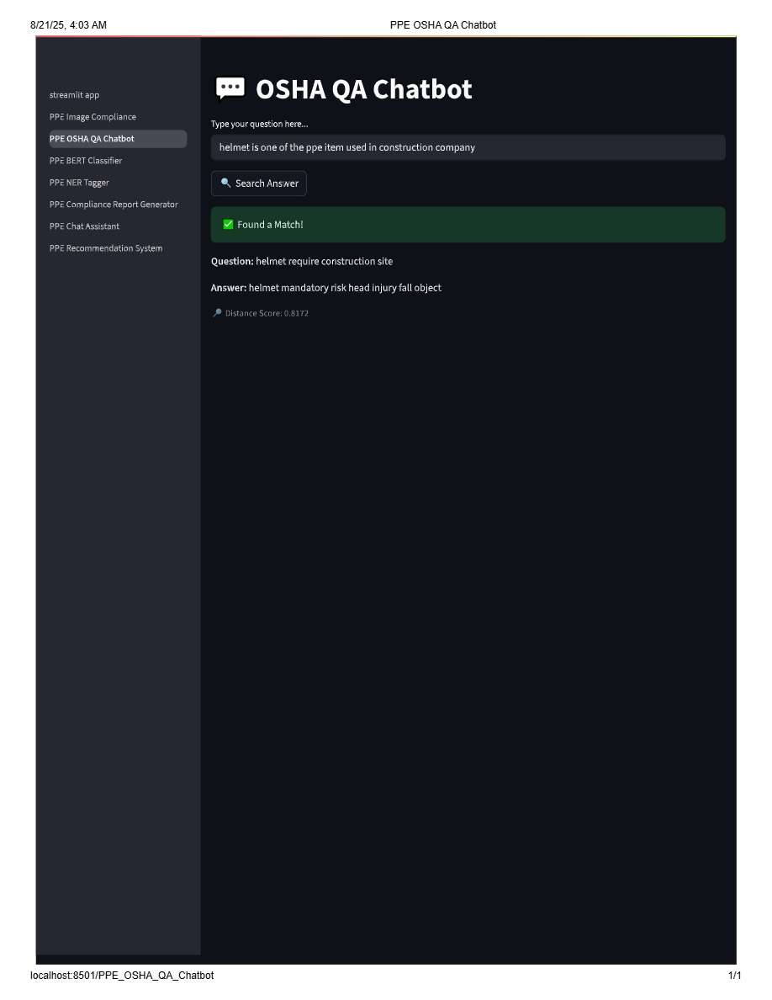
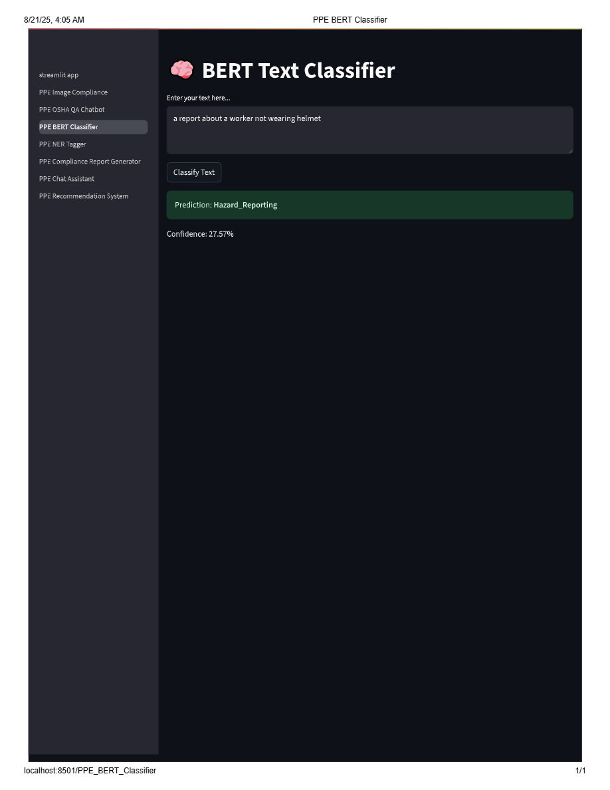
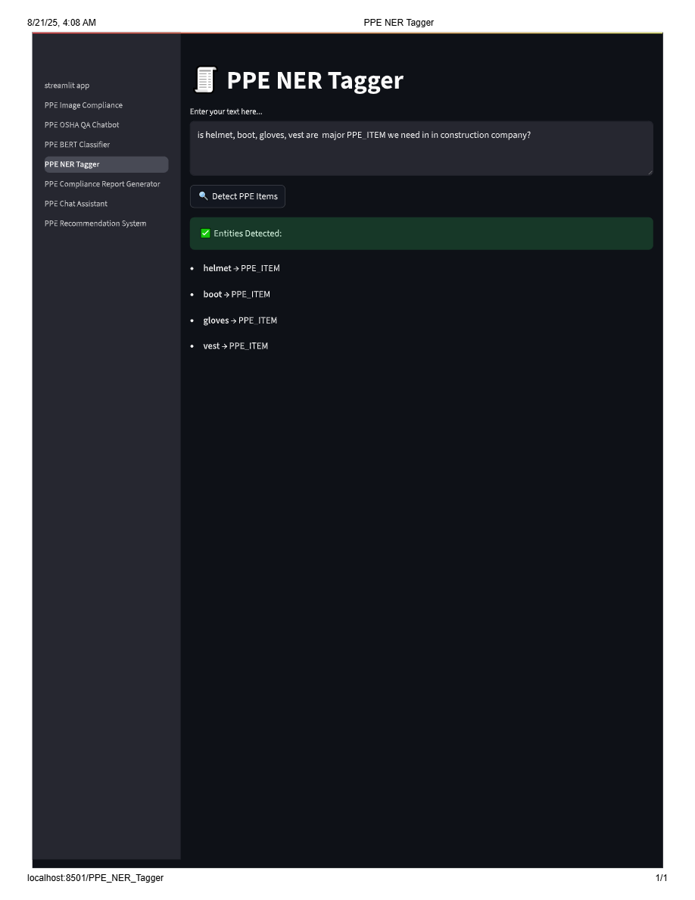
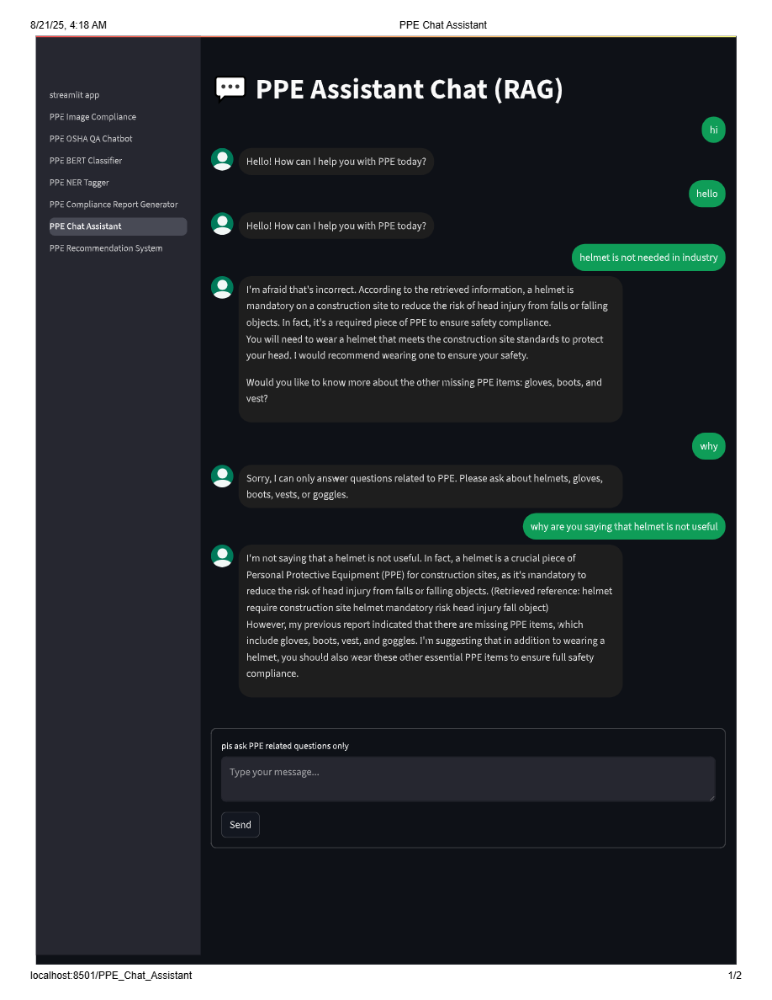
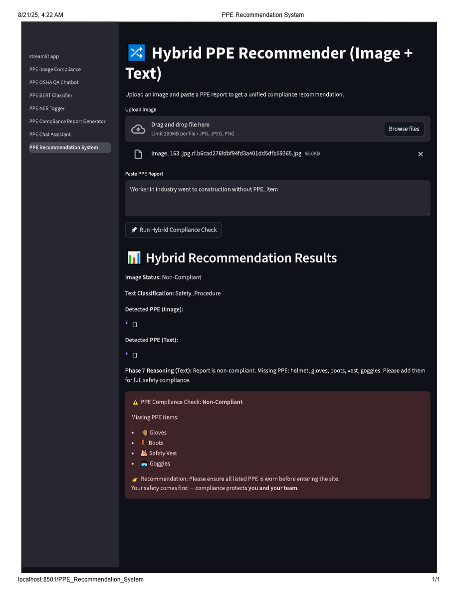

# SafeSight AI Assistant(PPE_VISION_360)

**Project tagline:** *From helmets to boots — AI-powered PPE compliance for safer construction worksites.*

<p align="center">


</p>

---

### Overview (Problem → MVP solution)

**Problem:**  
In construction and industrial environments, workers often forget or misuse PPE (helmets, boots, gloves, vests). Current inspection workflows are **manual, slow, and error-prone**, increasing risk of accidents and compliance issues.

**Solution / MVP:**  
SafeSight AI Assistant is an **image-based PPE compliance system**. Users upload images of workers or site conditions, and the system:  
- Detects PPE items using **YOLOv8**.  
- Classifies worn vs. not-worn PPE.  
- Generates human-readable compliance reasoning using **BERT + NER**.  
- Provides a **retrieval-augmented chatbot (FAISS + LLM)** for PPE-specific questions.

> Note: This MVP currently **only works with images**, not live camera feeds. Accuracy is limited due to **small dataset and GPU constraints**. Adding more labeled images will make the system **more robust and reliable**. Future deployment to embedded systems (Raspberry Pi / edge devices) is planned.

---

### Single-sentence MVP description

An image-based PPE compliance assistant that detects PPE items in photos, classifies presence/absence, and provides explainable compliance reasoning and corrective recommendations.

---

### What we built (current features)

- **YOLOv8 object detection** for helmets, boots, gloves, and vests.  
- **Segmentation & classification** for partial or incorrectly worn PPE.  
- **BERT-based OSHA-style question classifier** for compliance reasoning.  
- **NER module** to extract PPE-related entities from reports.  
- **LLM-powered chatbot (RAG)** that answers only PPE compliance questions using FAISS retrieval.  
- **Streamlit dashboard** to visualize images, detections, explanations, and compliance reports.  

> Note: Future improvements include adding more PPE classes, expanding chatbot knowledge, and integrating real-time video monitoring.

---

### 🗂 Project Structure (Main Skeleton)

> This is the **main structure**; the production codebase contains **additional modules/configs** beyond this outline.
```
project/
├── app/
│   ├── streamlit_app.py                # Home/Dashboard
│   ├── pages/
│   │   ├── 1_PPE_Image_Compliance.py
│   │   ├── 2_PPE_OSHA_QA.py
│   │   ├── 3_PPE_BERT_Classifier.py
│   │   ├── 4_PPE_NER_Tagger.py
│   │   ├── 5_PPE_Chat.py
│   ├── fastapi.py                          
│
├── src/
│   └── PPE_VISION_360/
│       ├── __init__.py
│       ├── image_detection.py
│       ├── osha_qa.py
│       ├── bert_classifier.py
│       ├── ner_tagger.py
│       ├── chat_llm.py                
│       ├── compliance_reasoning.py     
│       ├── hybrid_recommender.py     
│       
│
├── models/
│   ├── saved_distillbert/
│   ├── ppe_ner_model/
│
├── datasets/
│   ├── nlp/
│       ├── osha_qa_cleaned.csv
│       ├── faiss_index.bin
│       ├── qa_embeddings.npy
│
├── requirements.txt
└── README.md
```

### Architecture

#### System overview (flowchart)



---

#### Sequence: Image → Decision → Report

```mermaid
sequenceDiagram
    participant U as User
    participant I as Image
    participant M as Model (YOLO + Classifiers)
    participant R as Reasoner (BERT + NER)
    participant L as LLM
    participant D as Dashboard

    U->>I: Upload image
    I->>M: Detect PPE items
    M->>R: Classified & verified PPE
    R->>L: Generate compliance reasoning
    L->>D: Return explanation & chatbot response
    D->>U: Display results + download options
 ```   
 ---

#### Chatbot RAG Explanation (Hybrid LLM + FAISS)
```mermaid
flowchart LR
    A[User Query / PPE Question] --> B[FAISS Vector Search]
    B --> C{Relevant PPE Context Found?}
    C -->|Yes| D[Retrieve Context & Metadata]
    C -->|No| E[Return Cannot Answer Outside PPE Scope]
    D --> F[LLM Generates Response Using Retrieved Context]
    F --> G[Provide Human-Friendly Answer / Recommendation]
    G --> H[Dashboard / Chat Interface]
    H --> A[User Sees Answer]
```
---
### Quickstart — How to Run Locally

#### Prerequisites
- Python 3.9+
- pip
- Virtual environment (venv / conda)
- (Optional) GPU + CUDA for faster YOLO training

----
#### Install Dependencies
```bash
python -m venv venv
source venv/bin/activate   # Windows: venv\Scripts\activate
pip install -r requirements.txt
```
---
#### Prepare Data

- Place labeled images in `data/` (YOLO format).  
- Include `osha_qna.csv` for BERT + FAISS compliance queries.
---
#### Run Inference / Dashboard

```bash
# Detect PPE in images
python run_inference.py --weights runs/best.pt --source demo_images/

# Run Streamlit dashboard
streamlit run app/streamlit_app.py
```

# Streamlit Cloud / Demo Link Placeholder

[]([[https://safesight-ai-assistant-azmwpgp2kgpbbrrdgsxvaq.streamlit.app/]])

### Limitations

- **Dataset size:** Current dataset is small → limited model accuracy.  
- **Only images supported:** No live camera feed yet.  
- **FAISS + LLM chatbot:** Can only answer PPE-related questions.  
- **GPU requirements:** Training larger models may fail without GPU.  

> These limitations are expected for an MVP; scaling the dataset and improving compute resources will increase robustness.

---

### Roadmap & Future Improvements

- Expand dataset with more images from diverse construction sites.  
- Add more PPE classes and edge cases for YOLO.  
- Improve chatbot coverage with larger FAISS index and dynamic RAG.  
- Deploy on embedded devices for real-time monitoring.  
- Add role-based dashboard with audit logs and report exports.

---

### Screenshots / UI Preview

You can add images here to show your dashboard:










---


### How to Contribute
- Fork the repository.
- Add or improve dataset, annotations, or model code.
- Submit a Pull Request (PR) including tests and an example image demonstrating your changes.

## 👤 Author
**Adebayo Gabriel** – ML Engineer (**AI × PPE **)  
- Project lead: You (SafeSight AI Assistant)
- Tools & models used: YOLOv8, BERT, FAISS, Streamlit, Python

## 🔗 Links 
📧 iyanuoluwaadebayo04@gmail.com | 🌐 [LinkedIn](https://www.linkedin.com/in/gabriel-adebayo-2a0ba2281) | [GitHub](https://github.com/iyan-coder)  

---


